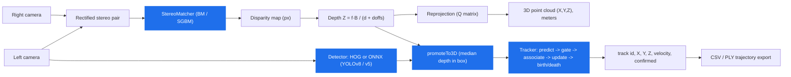

# stereo-3d-mot

**Real-time stereo vision pipeline in modern C++: rectified stereo → disparity → metric depth → 3D reprojection → detection → 3D multi-object tracking.**

Built as a from-scratch C++17 systems project on top of OpenCV and Eigen, developed
Linux-first inside Docker, with unit tests, a quantitative benchmark, and CI.

[](https://github.com/l4NGEL/stereo-3d-mot/actions/workflows/ci.yml)
[](https://en.cppreference.com/w/cpp/17)
[](LICENSE)

## What this project actually does

Feed it a pair of stereo camera images (or a recorded stereo sequence) and it will:

1. Turn the left/right pair into a metric **depth map** — how far away every pixel is, in meters, not just a disparity image.
2. **Detect objects** in the left image (cars, pedestrians, cyclists, …) with a YOLO model, running in C++ through ONNX Runtime.
3. Lift every 2D detection into **3D** using the depth at its location.
4. **Track every object through time in 3D**, giving each one a stable ID that survives brief occlusion, using a Kalman filter and a choice of three interchangeable matching strategies (3D distance, 2D box overlap, or a fusion of both plus appearance).
5. Export the tracked trajectories (CSV / PLY) and score them against ground truth with the same metrics (MOTA / MOTP / IDF1) the multi-object-tracking research literature uses.

This is the same class of problem an autonomous vehicle or ground robot's perception stack has to solve: turn two camera feeds into *"here is everything around me, in 3D, and here is where it's going."* Everything is written from scratch in C++17 — no ROS, no off-the-shelf SLAM/tracking framework — on OpenCV, Eigen, and ONNX Runtime, and it's validated on the real KITTI self-driving dataset, not just synthetic data.

## Results at a glance

| | |
| --- | --- |
| **Unit tests** | 109/109 passing (GoogleTest, enforced in CI) |
| **Real-time throughput** (Phase 6, tiled stereo + CPU detection) | 4.9 → **7.8 FPS**, a real 1.6x over the pre-optimisation baseline |
| **Stereo matching speedup** from tiling | **1.95x** (152.8 → 78.5 ms/frame), tracking output bit-identical before/after |
| **Identity tracking quality**, synthetic occlusion test (IDF1) | depth-aware 3D association **0.989** vs 2D-only baseline **0.543** |
| **Identity tracking quality**, real KITTI driving data, 3 sequences | appearance-fused association is never the worst of 3 methods; wins outright on 1 of 3 |
| **MOT metrics implementation** (CLEAR-MOT + IDF1, from scratch) | cross-validated against `py-motmetrics` (the reference library) on 400+ trials |
| **GPU (RTX 2080) vs. 16-thread CPU** for detection | measured, and honestly reported: **no speedup** for this model at batch size 1 |

Full numbers, methodology, and the honest caveats behind every one of these are in [KITTI evaluation](#kitti-evaluation), [Phase 5](#phase-5--appearance-aware-reid-association), and [Phase 6](#phase-6--real-time-optimisation) below.

---

## Pipeline



Association inside the tracker is gated by chi-square Mahalanobis distance in 3D, 2D IoU, or a fusion of both plus an appearance cue — pick per run, see [Tracking → 3D MOT](#tracking--3d-mot). Every stage above is implemented and covered by tests.

## Example output


Left → right: the left camera frame (three cards at known depths in front of a textured background; overlaid with detections/tracks when `--track` is on), colorized **estimated** disparity, colorized **depth** (metres), and **ground-truth** disparity for comparison. Generated with `make demo` on the built-in synthetic scene, which is used throughout this README as a controlled, ground-truth-exact scenario before trusting results on real KITTI data.

## Why this project

It pairs a real computer-vision pipeline with the C++ / build / tooling side that
job specs in robotics and defense perception ask for:

| Requirement                        | Where it lives                                             |
| ---------------------------------- | --------------------------------------------------------- |
| Stereo / mono depth estimation     | `depth/`, `camera/`, `geometry/`                          |
| Geometric computer vision          | `StereoRig` (Q matrix, triangulation), `CameraModel`      |
| Deep model inference in C++        | `detection/` (ONNX Runtime, `OnnxDetector`)               |
| C++17, OpenCV, Eigen, ONNX Runtime | throughout                                                |
| Linux, CMake, Git, Docker          | `Dockerfile`, `docker-compose.yml`, `Makefile`, CMake     |
| Unit testing & verification        | `tests/` (GoogleTest), `benchmark_depth`, `benchmark_detect` |
| CI                                 | `.github/workflows/ci.yml`                                |
| Real-time / performance mindset    | `ProfileRegistry`, `FpsMeter`, latency percentiles        |

## Quick start (Docker — recommended)

No local C++ toolchain needed; you build in the same Ubuntu image CI uses. Each
target builds the image and compiles on first run, then reuses both.

```bash
make test     # build the image, compile, run the unit tests (ctest)
make demo     # end-to-end demo on the synthetic scene -> ./out/ (image board + PLY per frame)
make bench    # quantitative depth benchmark on the synthetic scene (exact ground truth)
make shell    # interactive shell in the dev image, source bind-mounted
```

Docker Desktop must be running.

## Quick start (native Linux)

```bash
sudo apt-get install -y build-essential cmake ninja-build pkg-config \
    libopencv-dev libeigen3-dev libgtest-dev

# optional: ONNX Runtime for the OnnxDetector (prebuilt CPU release)
ORT=1.19.2
curl -fsSL "https://github.com/microsoft/onnxruntime/releases/download/v${ORT}/onnxruntime-linux-x64-${ORT}.tgz" \
  | sudo tar -xz -C /opt --one-top-level=onnxruntime --strip-components=1

cmake -S . -B build -G Ninja -DCMAKE_BUILD_TYPE=RelWithDebInfo \
    -DONNXRUNTIME_ROOT=/opt/onnxruntime           # omit to build without ONNX
cmake --build build --parallel
LD_LIBRARY_PATH=/opt/onnxruntime/lib ctest --test-dir build --output-on-failure

./build/apps/stereo_depth_demo --source synthetic --out out --cloud
./build/apps/benchmark_depth   --source synthetic
```

Only `core imgproc calib3d imgcodecs objdetect` are actually linked, so the
individual `libopencv-<module>-dev` packages work too; CMake also accepts a
pkg-config `opencv4` if the CMake package is absent. `-DS3M_WITH_ONNX=OFF`
builds the geometry pipeline with no ONNX dependency at all.

Windows: use the Docker workflow, or WSL2 + the native steps above.

## Running on Middlebury 2014

```bash
# grab one scene (im0.png, im1.png, calib.txt, disp0.pfm)
scripts/download_middlebury.sh Motorcycle        # -> data/middlebury/Motorcycle

./build/apps/benchmark_depth --source data/middlebury/Motorcycle
./build/apps/stereo_depth_demo --source data/middlebury/Motorcycle --out out --cloud
```

The loader parses `calib.txt` (per-view `cx`, `doffs`, `baseline` in mm), reads
the `.pfm` ground-truth disparity, and converts it to a metric depth map so both
disparity and depth accuracy are reported. See [data/README.md](data/README.md).

## Detection → 3D

`OnnxDetector` runs a YOLO-family ONNX model on the left image (ONNX Runtime,
CPU). It auto-detects the output layout — YOLOv8 `[1, 4+nc, N]` or YOLOv5
`[1, N, 5+nc]` — does letterbox pre-processing, class-aware NMS, and maps boxes
back to original pixels. Each surviving box is promoted to 3D with the median
depth inside it (`promoteTo3D`), giving a metric `Z` and an `(X, Y, Z)` position
in the left-camera frame.

```bash
# training / export stays in Python, inference is C++
pip install ultralytics
python scripts/export_yolov8.py --weights yolov8n.pt          # -> models/yolov8n.onnx

./build/apps/stereo_depth_demo --source synthetic --detector onnx \
    --model models/yolov8n.onnx --out out
./build/apps/benchmark_detect  --detector onnx --model models/yolov8n.onnx --frames 50
```

`--detector hog` uses OpenCV's built-in pedestrian HOG (no model file).
ONNX Runtime is optional: without it (`-DS3M_WITH_ONNX=OFF`, or not installed)
the project still builds and `--detector onnx` falls back to a warning + no-op.
The `test_onnx_detector` suite runs against a 99 KB hand-built ONNX fixture
(`scripts/make_test_model.py`) — no download, deterministic.

## Tracking → 3D MOT

`Tracker` runs each frame's `Detection3D`s through predict → associate →
update/coast → birth/death. Three association methods read from the exact
same `Track` state, so they're a fair, swappable comparison — not different
trackers:

| `tracking.association` | cost function | uses depth for the *decision*? |
|---|---|---|
| `mahalanobis3d` (default) | chi-square-gated squared Mahalanobis distance in 3D | yes |
| `iou2d` | 1 − IoU on the last matched 2D box | no (the classic baseline) |
| `fused` | weighted blend of both plus an appearance cue — [Phase 5](#phase-5--appearance-aware-reid-association) | yes, plus appearance |

All three respect `tracking.use_hungarian` (optimal Kuhn-Munkres, default) vs
a greedy nearest-first baseline (`solveAssignmentGreedy`), and a hard
class-id gate. Enable one in the demo and export the trajectories:

```bash
./build/apps/stereo_depth_demo --source synthetic --detector onnx \
    --model models/yolov8n.onnx --track \
    --trajectories out/tracks.csv --trajectories-ply out/tracks.ply --out out
```

`benchmark_track` exercises this on a hermetic synthetic scene where a near
object (2 m) and a far object (9 m) cross paths and occlude one another —
a controlled way to test one specific claim (does gating on depth resolve an
occlusion 2D overlap alone can't) before trusting it on real data:

```bash
$ ./build/apps/benchmark_track --frames 120
```

| method | ID switch | ID consist.% | MOTA | IDF1 |
| --- | --- | --- | --- | --- |
| 3D Mahalanobis + Hungarian | 2 | **99.5%** | 0.979 | **0.989** |
| 2D IoU + Hungarian | 2 | 58.3% | 0.929 | 0.543 |

Same switch count, very different consistency — IDF1 (the metric built to
measure identity correctness, not just presence) shows the IoU tracker gets
barely half credit for keeping the right label on the right object.

<details>
<summary>Full methodology, why ID consistency (not raw switch count) is the number to read, and the seed sweep</summary>

The renderer already draws nearer cards over farther ones, so the simulated
detector realistically stops firing on the far object while it's occluded — a
real gap to re-acquire across, not just noisy boxes. This is **not** a general
"3D beats 2D" result — it's one scene, two objects, synthetic noise. Raw
ID-switch counts alone are also a misleading headline number here: a handful
of switches that each resolve back to the right id within a couple of frames
(typical of the Mahalanobis runs) hurts identity quality far less than the
same count from switches that stick (typical of the IoU runs), which is why
**ID consistency** — the fraction of a track's lifetime spent under its
dominant id — is the number to read first, alongside IDF1 rather than MOTA
(which barely moves between the two methods here, since it's dominated by
presence, not identity).

Swept across `--seed 1..5`: Mahalanobis holds 98–100% ID consistency every
time, IoU2D lands at 58–61% in 4 of 5 seeds and ties Mahalanobis at 100% in
the fifth, when that particular run's noise never seriously tests either
method. The honest claim from this benchmark is scoped: *in this simulated
occlusion scenario, depth-aware association substantially improved identity
consistency over the 2D IoU baseline.* Whether that holds on real detections
and real occlusions is exactly what the KITTI evaluation below is for.

`TrackerTest.DepthSeparatesOccludingBoxesIou2DGetsItWrong` pins the mechanism
down to a single frame with hand-verified numbers: one new detection sitting
exactly on a far track's last box (IoU = 1) but carrying the near object's true
depth — the IoU-only tracker takes the box overlap and assigns it to the far
track; the Mahalanobis tracker takes the depth and assigns it to the near one.

</details>

## KITTI evaluation

`MotAccumulator` is a from-scratch CLEAR-MOT + IDF1 implementation, validated
against **py-motmetrics** (the reference library) on 400+ trials.
`benchmark_kitti` runs the real pipeline — stereo depth, the ONNX detector,
`promoteTo3D`, `Tracker` — on an actual downloaded KITTI driving sequence:

```bash
scripts/download_kitti.sh 0000 --with-images   # calib+labels always (~10 MB); one sequence's
                                                # images via HTTP range requests (~265 MB, not
                                                # the ~30 GB full archives -- see the script)
./build/apps/benchmark_kitti --kitti-root data/kitti --sequence 0000 \
    --detector onnx --model models/yolov8n.onnx --config configs/kitti.yaml
```

`sequence 0000` (154 frames, a short residential drive) — detector = ONNX (yolov8n, COCO), gate = 2 m:

| method | MOTA | MOTP | IDF1 | IDSW | FP | FN |
| --- | --- | --- | --- | --- | --- | --- |
| 3D Mahalanobis | -2.304 | 0.995 m | 0.182 | 33 | 2195 | 121 |
| 2D IoU | -2.135 | 1.020 m | **0.187** | 35 | 1980 | 214 |

MOTA is negative and 2D/3D land close together here — both explained below,
not swept under the rug.

<details>
<summary>Why MOTA is negative (not a bug), why 2D/3D converge on real data, and the config tuning behind it</summary>

`configs/kitti.yaml` restricts the detector to COCO's road-relevant classes
(person, bicycle, car, motorcycle, bus, truck) and raises `measurement_noise`
from the synthetic scene's 0.05 m to 1.0 m — real SGBM stereo error on KITTI
ranges is far larger than the synthetic scene's simulated jitter (confirmed
by this very run: MOTP, the average position error over *matched* pairs
only, comes out to ~1 m), and the tighter synthetic-tuned default
over-rejected genuinely correct matches in the Mahalanobis gate.

**Two honest findings here, not one clean headline:**

- **Absolute MOTA is negative, and that's a detector/GT domain-mismatch
  artifact, not a pipeline bug.** Spot-checking frame 0: YOLOv8n correctly
  finds 4 cars + 3 bicycles + 2 people in the image; KITTI's tracking GT for
  that same frame labels exactly 3 objects (1 Van, 1 Cyclist, 1 Pedestrian).
  Averaged over the whole run, confirmed tracks outnumber GT objects roughly
  4:1. KITTI's *tracking* ground truth is not an exhaustive census of every
  visible instance of its classes the way the detection benchmark is — a
  general-purpose COCO detector, with no KITTI-specific fine-tuning, finds
  plenty of real cars, bicycles and people the tracking labels simply don't
  include, and every one of those scores as a false positive under CLEAR-MOT.
  That's a known characteristic of scoring an off-the-shelf detector against
  KITTI tracking GT directly, confirmed by re-deriving MOTA/MOTP/IDF1 against
  py-motmetrics.
- **On real data, 2D IoU and 3D Mahalanobis land close together — this is not
  a rerun of the synthetic-scene result.** The synthetic benchmark above
  shows Mahalanobis clearly ahead (IDF1 0.989 vs 0.543) because its simulated
  depth was clean by construction. Real stereo depth is noisier — MOTP ~1 m
  here, and growing with range — so on this sequence the two methods come out
  close. The honest reading: depth-aware association's advantage is real but
  conditional on depth quality — decisive when depth is accurate, and eroded
  once stereo noise grows large enough to rival the gate size. That's exactly
  the kind of gap the ReID/appearance-fusion work in Phase 5 is meant to help
  close, by giving the associator a cue that doesn't degrade with depth noise.

</details>

## Phase 5 — Appearance-aware (ReID) association

A third association cue, fused with the existing two as
`C = α·C_3D + β·C_IoU + γ·C_ReID` (`AssociationMethod::kFusedAppearance`), a
classical HSV color histogram (not a learned ReID embedding — see below)
compared with `cv::compareHist`'s Bhattacharyya distance.

**Synthetic scene:**

| method | ID switch | ID consist.% | IDF1 |
| --- | --- | --- | --- |
| 3D Mahalanobis + Hungarian | 2 | 99.5% | 0.989 |
| 2D IoU + Hungarian | 2 | 58.3% | 0.543 |
| 3D+IoU+ReID + Hungarian | 0 | **100.0%** | **0.989** |

**Real KITTI, three sequences at different occlusion levels** (not just one — see below for why that matters):

| sequence | occlusion | IDF1 (3D / 2D / Fused) |
| --- | --- | --- |
| 0000 | 30% | 0.182 / 0.187 / **0.203** |
| 0003 | 49% | 0.223 / **0.301** / 0.283 |
| 0017 | 62% | **0.486** / 0.386 / 0.462 |

This is **not** "fusion wins" — it wins outright on 0000 only, and loses to
one pure cue or the other on 0003/0017. The real, more defensible pattern:
**fused is never the worst of the three, on any of the three sequences.**

<details>
<summary>Scope of the "ReID" cue, gating rationale, weight/ablation sweeps, and a real bug this phase caught</summary>

**Scope, stated up front**: the ReID cue is deliberately a classical color
histogram, not a learned embedding — it needs no model file, export step, or
new dependency, and is a real, long-established MOT technique for exactly the
role it plays here: one fusable cue among several, not the sole association
signal a real ReID network is designed to be. A learned embedding would
likely separate appearance better, especially between similarly-colored
objects — future work this project doesn't claim to have done.

Gating uses the *union* of the Mahalanobis and IoU gates, not their
intersection: deliberately looser than either alone, because the whole point
of fusing in a second geometric cue plus appearance is staying robust when
one cue is unreliable, and gating on the intersection would just inherit
whichever cue is currently worse. A detection or track with no appearance
descriptor yet falls back to a neutral 0.5 appearance cost rather than being
excluded.

`TrackerTest.FusedAppearanceRecoversIdentityMahalanobisAloneGetsWrong` pins
the mechanism down with hand-verified numbers: two tracks settle at close
depths (2.00 m red, 2.10 m blue); a red disambiguating detection sits
geometrically *closer* to the wrong (blue) track (0.07 m from red vs 0.03 m
from blue — plain Mahalanobis prefers blue by a clear margin). Fusing in
appearance correctly recovers red.

The fusion weights (0.5/0.2/0.3 by default, `TrackerParams::fused_weight_*`)
were set by reasoning plus those unit tests, not tuned against the benchmark
numbers above. **Weight sensitivity** (`--sweep`, five settings from
0.4/0.3/0.3 to 0.6/0.1/0.3): IDF1 moves by at most ~0.04 across the whole
grid, and the three-sequence ranking (fused beats one pure cue, loses to the
other, never worst) holds at every tested setting. **Cue ablation**
(3D-only / 3D+IoU / 3D+appearance / full fused) confirms appearance and IoU
are each pulling real weight — neither alone matches the full fused row
(caveat: the *gate* is always the union of both geometric gates regardless
of weight, so "no IoU" still benefits from IoU admitting candidates
Mahalanobis alone wouldn't; a fully independent ablation would need separate
gating per combination).

**A real bug, caught by a determinism check.** Building `--sweep` (many
association variants run back-to-back over one cached frame set) surfaced a
genuine bug: `Track`'s constructor stored its initial appearance descriptor
via `cv::Mat`'s shallow, reference-counted copy, so a newly-born track's
descriptor *aliased* the same buffer as the cached detection it was born
from, and `Track::correct()`'s EMA blend then mutated that cached,
supposedly-read-only frame data in place — the same (association, weights)
setting gave different IDF1/IDSW depending on how many other variants had
already run first in the same process. Fixed by `.clone()`-ing on ingestion;
this did **not** affect any previously-published number, since everything
outside `--sweep` recomputes detections fresh per run with nothing shared to
alias, but would have silently corrupted every number in this section had
`--sweep` shipped without the determinism check that caught it.

</details>

## Phase 6 — Real-time optimisation

Profiled the real pipeline on real KITTI data before optimising anything —
`sequence 0000`, 154 frames, `cv::getNumThreads() = 16`:

| stage | cost |
| --- | --- |
| stereo | 152.8 ms/frame |
| capture (imread) | 137.9 ms/frame |
| detect | 49.5 ms/frame |
| depth + promote3d + appearance | <2 ms/frame combined |
| track | 0.19 ms/frame |

Stereo matching dominates (~3x detection's cost), so that's what got
optimised: tiling it into parallel horizontal strips bought a real **1.95x
speedup** (152.8 → 78.5 ms/frame) with a bit-identical tracking result. GPU
detection (a real RTX 2080) was also built and measured — and, honestly
reported, gave essentially no speedup for this small a model at batch size 1.
**End to end: 4.9 → 7.8 FPS**, a real ~1.6x, short of the 20 FPS target.

<details>
<summary>Full profiling breakdown, the tiling tuning story, and the GPU measurement in detail</summary>

`capture (imread)` is almost as expensive as stereo matching itself; that's
very likely a Docker-Desktop-on-Windows bind-mount filesystem artifact
(WSL2 cross-boundary I/O for many small PNG reads), not real algorithmic
cost or something a native-Linux deployment would pay.

**Threading isn't uniform, and that's the whole reason tiling needed new
code.** `--threads 1` vs the default (16 cores): `detect` goes 121.9 → 47.0 ms
(2.6x — ONNX Runtime's own intra-op parallelism already uses every core, no
code required), but `stereo` barely moves (145.9 → 143.0 ms — OpenCV's
StereoSGBM in this build doesn't meaningfully parallelise internally). So
detection's "multi-thread" roadmap item was already done by the library;
stereo's wasn't, and needed real tiling work.

**Tiled the matcher**: horizontal strips, one independent matcher per strip
(OpenCV's BM/SGBM keep internal scratch state unsafe to share across
concurrent `compute()` calls), `cv::parallel_for_` across strips, a small
overlap margin cropped off before stitching so seams don't show. `num_tiles
<= 1` (the default everywhere except `configs/kitti_tiled.yaml`) is
byte-identical to the pre-Phase-6 code path.

The first overlap margin (a conservative `max(32, 8·block)` = 40 rows) was
too generous for KITTI's short (~375-row) images: past `num_tiles=8` the
margin competes directly with tile height, and at 16 tiles the *result was
net slower than not tiling at all* (468 ms vs 163 ms) — more tiles just
means redoing more of your neighbours' work. Tightened to `max(16, 3·block)`
= 16 rows after confirming accuracy held (RMSE 1.192 vs 1.191 untiled). The
sweet spot moved to **`num_tiles=4`**; `num_tiles=8` is barely ahead of
untiled and 16 is still a net loss. The finding that matters isn't the
number 4, it's that **overlap-to-tile-height ratio, not core count, sets the
practical tile-count ceiling** on a given image size.

**MOT-metric impact: unmeasurable.** Re-ran the full KITTI table with tiling
on against the untiled numbers — IDF1, IDSW, fragmentation, FP/FN, MOTA,
precision and recall are **bit-identical** for all three association
methods; only MOTP shifts in the 5th decimal place.

**GPU-accelerated detection.** A real NVIDIA GPU (RTX 2080, 8 GB), confirmed
reachable from Docker (`--gpus all`). `Dockerfile.gpu` builds a separate
image on CUDA 12.4 + cuDNN 9 with ORT's GPU tarball;
`OnnxDetector::Options::use_cuda` registers the CUDA execution provider with
no silent CPU fallback (throws if the EP genuinely isn't available), so the
comparison can't accidentally be CPU-vs-CPU. Detection results are
**bit-identical** to CPU, so this is a correctness-verified comparison, not
just "it ran without crashing."

Measured: **`detect` on CUDA EP is 48.4 ms/frame vs CPU's ~49.5–54.3 ms/frame
(16 threads) — essentially no speedup** (re-confirmed after ruling out a
system-load confound from unrelated background work on the machine).
YOLOv8n is a genuinely tiny model (~3.2 M parameters) run one image at a
time: at that scale, fixed per-call overhead (kernel launches, host↔device
transfer, no batching to amortize it) competes directly with the actual
compute, and a 16-thread CPU running well-optimized kernels turns out to be
genuinely competitive. Named next steps that could still move this (not
attempted here): FP16 inference, `IOBinding`, CUDA graph capture, or
batching multiple frames.

**End to end**: 342.2 → 238.4 ms/frame (2.92 → 4.19 FPS) including the imread
artifact; 204.2 → 128.2 ms/frame (4.90 → **7.80 FPS**) excluding it. The
honest ceiling on this pipeline, on this hardware, without deeper GPU-specific
work or porting stereo matching itself to `cv::cuda::StereoSGBM` (this
project's apt-installed OpenCV isn't built with CUDA support), is CPU-bound
tiled-SGBM plus CPU-or-GPU-equivalent detection — not a GPU win waiting to be
unlocked by more casual effort.

`depth`, `promote3d+appearance` and `track` combined cost under 2 ms per
frame, so there's no meaningful copy/allocation overhead hiding in this
project's own glue code — the two real costs (`stereo`, `detect`) are
library-internal compute, not inefficiencies in code written here.

</details>

## Example benchmark output

Measured on the built-in synthetic scene (640×480, default config: SGBM,
`num_disparities = 128`, `block_size = 5`), background plane at 12 m plus three
closer cards:

```
$ ./build/apps/benchmark_depth --source synthetic --frames 5

matcher = SGBM   num_disparities = 128   block_size = 5
frames  = 5      match: mean ~120 ms  (single-threaded SGBM, RelWithDebInfo)

disparity (px):  RMSE 1.03   bad-2.0 0.7%    density 99.2%
depth (m):       RMSE 0.66   abs-rel 1.2%    delta<1.25 99.3%
```

Dropping to `num_disparities = 64` roughly halves the matcher time. Middlebury
numbers will be lower — real photographs have textureless regions and
occlusions the synthetic scene doesn't. Numbers depend on your machine;
`--out <dir>` also writes a Markdown results table for pasting into a report.

## Project layout

```
include/s3m/            public headers                 src/            implementation
  core/    types, config (YAML), timing/profiling
  camera/  CameraModel (pinhole), StereoRig (baseline, doffs, Q, triangulation)
  depth/   StereoMatcher (BM/SGBM wrapper), DepthMetrics (RMSE / bad-px / delta)
  geometry/ reprojection: disparity -> point cloud / depth map / 3D detections
  io/      FrameSource, SyntheticStereoSource, MiddleburySource, KITTI loader,
           PFM, PLY, trajectory CSV/PLY export
  detection/ Detector interface, HOG, OnnxDetector (ORT), letterbox, NMS, COCO
  tracking/  KalmanFilter, Track, assignment (Hungarian/greedy), Tracker,
             MotAccumulator (CLEAR-MOT + IDF1)
  viz/     depth / disparity colourisation, image tiling, detection/track overlays

apps/    stereo_depth_demo, benchmark_{depth,detect,track,kitti}
tests/   GoogleTest suites (18 files) + tests/data/ ONNX fixture
cmake/   warning flags, FindONNXRuntime        configs/ default.yaml
docs/    architecture.md, roadmap.md           scripts/ datasets, model export
```

## The geometry, briefly

Rectified horizontal stereo, left camera as the reference frame (OpenCV axes:
X right, Y down, Z forward). For a point at depth `Z`:

```
d = fx * B / Z - doffs                 doffs = cx_right - cx_left  (0 if perfectly rectified)
Z = fx * B / (d + doffs)
```

`StereoRig::reprojectionMatrix()` returns the 4×4 `Q` with
`[X Y Z W]ᵀ = Q · [u v d 1]ᵀ`, consistent with `cv::reprojectImageTo3D` and with
`StereoRig::triangulate()` — a property checked directly in
[`tests/test_stereo_rig.cpp`](tests/test_stereo_rig.cpp).

## Roadmap

1. **Stereo depth core — done.** geometry, BM/SGBM, depth, reprojection, PLY,
   synthetic + Middlebury sources, benchmark, tests, Docker, CI.
2. **Detection in the loop — done.** ONNX Runtime detector (YOLOv8/v5), letterbox
   + class-aware NMS, 2D → 3D promotion in the demo, `benchmark_detect`.
3. **3D multi-object tracking — done.** `Tracker` (Hungarian/greedy, chi-square
   Mahalanobis-3D or IoU-2D association, class gate, birth/death), trajectory
   export, `benchmark_track` head-to-head comparison.
4. **KITTI + MOTA/MOTP/IDF1 — done.** `MotAccumulator` (validated against
   py-motmetrics), the KITTI tracking loader, and `benchmark_kitti` all run
   against a real downloaded sequence; see [KITTI evaluation](#kitti-evaluation).
5. **Appearance-aware association (ReID) — done.** A third cost term
   (classical color-histogram appearance, not a learned embedding — scoped
   deliberately) fused with the existing geometric cues; validated on three
   real KITTI sequences at different occlusion levels — never the worst of
   the three methods, wins outright on one. See
   [Phase 5](#phase-5--appearance-aware-reid-association).
6. **Real-time optimisation — done.** Profiled the real pipeline on real
   KITTI data first: stereo matching dominates (~3x detection's cost),
   detection already scales across cores for free (ONNX Runtime's own
   threading), stereo didn't and needed real tiling work — a measured 1.95x
   stereo speedup with a bit-identical tracking result. GPU detection built
   and measured for real on an actual RTX 2080 — and turned out not to help
   at batch size 1 for a model this small, a genuine, counter-intuitive
   finding reported honestly rather than assumed away. ~1.6x end to end,
   short of the 20 FPS target. See
   [Phase 6](#phase-6--real-time-optimisation).
7. Visual odometry: feature tracks, essential matrix, camera pose — touches the
   VI-SLAM side.
8. ROS2 integration (optional / bonus), once Phases 6–7 give the stack
   something worth wrapping in a node graph.

Details and rationale in [docs/roadmap.md](docs/roadmap.md).

## License

MIT — see [LICENSE](LICENSE).
