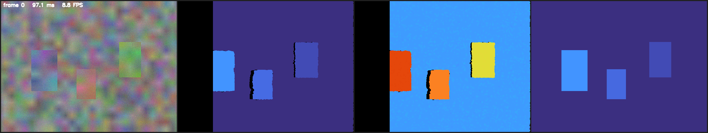

# Stereo 3D MOT

**Real-time stereo vision pipeline in modern C++17:**
Rectified Stereo → Disparity → Metric Depth → 3D Reprojection → Detection → 3D Multi-Object Tracking

[](https://github.com/l4NGEL/stereo-3d-mot/actions/workflows/ci.yml)
[](https://en.cppreference.com/w/cpp/17)
[](LICENSE)

A from-scratch C++17 computer-vision systems project built with OpenCV, Eigen and ONNX Runtime. The project runs Linux-first in Docker and includes unit tests, synthetic benchmarks, real KITTI evaluation, profiling and CI.

**Current status:** Phases 1–6 are implemented and run end-to-end on real KITTI data, including on a real NVIDIA GPU. The project currently contains stereo depth, YOLOv8/v5 inference, 3D multi-object tracking, KITTI evaluation, appearance-aware association and real-time optimisation.

## What does this project do?

In simple terms, the system takes two camera images (left + right) and tries to answer:

- How far away is each pixel?
- Where is an object in 3D space?
- Which object in the current frame corresponds to an object from the previous frame?
- Can we follow that object's position over time?

The pipeline:

```
Left Camera ───┐
                ├──→ Rectification
Right Camera───┘
                     │
                     ▼
              Stereo Matching
               (BM / SGBM)
                     │
                     ▼
              Disparity Map
                     │
                     ▼
        Metric Depth: Z = fB/(d+doffs)
                     │
                     ▼
              3D Reprojection
                  (X, Y, Z)
                     │
        ┌────────────┴────────────┐
        ▼                         ▼
   2D Detector                3D Point Data
  (YOLOv8 / YOLOv5)                │
        │                         │
        ▼                         │
   2D Bounding Box                │
        │                         │
        ▼                         │
   Promote to 3D ◄────────────────┘
        │
        ▼
     Tracker
        │
        ▼
Predict → Gate → Associate → Update
        │
        ▼
 Track ID + X,Y,Z + velocity
        │
        ▼
 CSV / PLY trajectory export
```

Every stage above is implemented and covered by tests.

### Example output



Left → right: the left camera frame (three cards at known depths in front of a textured background), colorized estimated disparity, colorized depth (metres), and ground-truth disparity for comparison — generated with `make demo` on the built-in synthetic scene.

## Key Features

### Stereo Vision
- Stereo calibration and rectification
- Block Matching (BM)
- Semi-Global Block Matching (SGBM)
- Disparity → metric depth conversion
- 3D reprojection with the OpenCV Q matrix
- Point-cloud / PLY export

### Object Detection
- YOLOv8 / YOLOv5 through ONNX Runtime
- CPU inference
- Optional CUDA execution provider
- Letterbox preprocessing
- Class-aware NMS
- Automatic support for YOLOv8 and YOLOv5 output layouts
- 2D bounding box → 3D position using median depth

### 3D Multi-Object Tracking

Three interchangeable association strategies:

| Method | Association |
| --- | --- |
| `mahalanobis3d` | Chi-square-gated Mahalanobis distance in 3D |
| `iou2d` | 2D bounding-box IoU |
| `fused` | 3D + 2D IoU + appearance |

The tracker also supports:
- Hungarian assignment
- Greedy assignment
- Class gating
- Track birth / death
- Prediction and coast/update logic
- Trajectory export

### Appearance Association

The fused tracker adds an appearance cue:

```
C = α·C_3D + β·C_IoU + γ·C_ReID
```

The current appearance descriptor is a classical HSV color histogram, not a learned ReID network. Default weights: α = 0.5, β = 0.2, γ = 0.3.

### Evaluation
- Synthetic ground-truth benchmark
- Middlebury 2014 support
- KITTI Tracking Benchmark loader
- MOTA, MOTP, IDF1, ID switches, Fragmentation, Precision / Recall
- Depth RMSE, Bad-pixel rate, Relative depth error

### Engineering
- C++17, CMake + Ninja, Docker
- GoogleTest
- GitHub Actions CI
- Runtime profiling and performance benchmarking

## Quick Start

### Option 1 — Docker (Recommended)

You do not need a local C++ toolchain. Requirements: Docker Desktop, Git.

```bash
make test     # Runs the unit tests.
make demo     # Runs the end-to-end synthetic demo and writes results to ./out/.
make bench    # Runs the quantitative depth benchmark.
make shell    # Opens an interactive development shell.
```

### Option 2 — Native Linux

Install dependencies:

```bash
sudo apt-get install -y \
    build-essential \
    cmake \
    ninja-build \
    pkg-config \
    libopencv-dev \
    libeigen3-dev \
    libgtest-dev
```

Optional: ONNX Runtime

```bash
ORT=1.19.2
curl -fsSL \
  "https://github.com/microsoft/onnxruntime/releases/download/v${ORT}/onnxruntime-linux-x64-${ORT}.tgz" \
  | sudo tar -xz -C /opt \
      --one-top-level=onnxruntime \
      --strip-components=1
```

Build:

```bash
cmake -S . -B build -G Ninja \
  -DCMAKE_BUILD_TYPE=RelWithDebInfo \
  -DONNXRUNTIME_ROOT=/opt/onnxruntime

cmake --build build --parallel
```

Run tests:

```bash
LD_LIBRARY_PATH=/opt/onnxruntime/lib \
ctest --test-dir build --output-on-failure
```

Run the synthetic demo:

```bash
./build/apps/stereo_depth_demo \
  --source synthetic \
  --out out \
  --cloud
```

Run the depth benchmark:

```bash
./build/apps/benchmark_depth \
  --source synthetic
```

### Building without ONNX Runtime

The geometry/depth pipeline can be built without ONNX:

```bash
cmake -S . -B build \
  -DS3M_WITH_ONNX=OFF
```

Windows: use the Docker workflow, or WSL2 + the native steps above.

## Middlebury 2014

The project includes a Middlebury loader and depth benchmark.

Download a scene:

```bash
scripts/download_middlebury.sh Motorcycle
```

This creates `data/middlebury/Motorcycle`.

Run the benchmark and demo:

```bash
./build/apps/benchmark_depth --source data/middlebury/Motorcycle
./build/apps/stereo_depth_demo --source data/middlebury/Motorcycle --out out --cloud
```

The loader reads `calib.txt`, `im0.png`, `im1.png`, and `disp0.pfm`. The ground-truth disparity is converted to metric depth so both disparity and depth accuracy can be evaluated. See [data/README.md](data/README.md).

## Detection → 3D

Detection is performed on the left camera image. The current implementation supports YOLOv8 and YOLOv5 exported to ONNX. Training/export remains in Python; inference is performed in C++.

```bash
pip install ultralytics
python scripts/export_yolov8.py --weights yolov8n.pt   # -> models/yolov8n.onnx

./build/apps/stereo_depth_demo --source synthetic --detector onnx \
    --model models/yolov8n.onnx --out out
./build/apps/benchmark_detect  --detector onnx --model models/yolov8n.onnx --frames 50
```

`--detector hog` uses OpenCV's built-in pedestrian HOG (no model file). ONNX Runtime is optional: without it, the project still builds and `--detector onnx` falls back to a warning + no-op.

### How 2D detection becomes 3D

```
2D Bounding Box
      │
      ▼
Read depth values inside the box
      │
      ▼
Take median depth
      │
      ▼
Obtain metric Z
      │
      ▼
Reproject using stereo geometry
      │
      ▼
3D position: (X, Y, Z)
```

The function responsible for this is `promoteTo3D`.

## 3D Multi-Object Tracking

The tracker processes detections frame by frame:

```
Predict → Gate → Associate → Update / Coast → Birth / Death
```

The same `Track` state is used for all association methods, making them directly swappable — not different trackers.

**1. 3D Mahalanobis** — `--association mahalanobis3d`: chi-square-gated squared Mahalanobis distance in 3D.

**2. 2D IoU** — `--association iou2d`: bounding-box overlap, no depth used at all.

**3. Fused** — `--association fused`: 3D distance + 2D IoU + appearance similarity.

Both Hungarian and greedy assignment are supported.

```bash
./build/apps/stereo_depth_demo --source synthetic --detector onnx \
    --model models/yolov8n.onnx --track \
    --trajectories out/tracks.csv --trajectories-ply out/tracks.ply --out out
```

### Synthetic tracking benchmark

Designed to test one specific question: **does depth-aware association help preserve object identity when two objects cross in the image?** The scene contains a near object (~2 m), a far object (~9 m), an occlusion/crossing event, controlled synthetic noise, and exact ground truth.

```bash
./build/apps/benchmark_track --frames 120
```

| Method | ID Switch | ID Consistency | Fragmentation | False Track |
| --- | --- | --- | --- | --- |
| 3D Mahalanobis + Hungarian | 2 | **99.5%** | 1 | 25.0% |
| 2D IoU + Hungarian | 2 | 58.3% | 2 | 60.0% |

Standard MOT metrics on the same runs:

| Method | MOTA | MOTP | IDF1 | IDSW | Frag |
| --- | --- | --- | --- | --- | --- |
| 3D Mahalanobis + Hungarian | 0.979 | 0.074 | **0.989** | 0 | 0 |
| 2D IoU + Hungarian | 0.929 | 0.204 | 0.543 | 2 | 2 |

These numbers describe this controlled synthetic scenario; they are **not** a general claim that 3D tracking always outperforms 2D tracking.

## KITTI Evaluation

The project also evaluates the complete pipeline on real KITTI tracking data:

```
KITTI Stereo Images → Stereo Depth → YOLO Detector → 2D→3D Promotion → 3D MOT Tracker → MOTA / MOTP / IDF1
```

The implementation includes a from-scratch `MotAccumulator` supporting CLEAR-MOT (MOTA, MOTP, ID switches, fragmentation, precision, recall) and IDF1, validated against **py-motmetrics** using randomized trials and hand-built edge cases.

```bash
scripts/download_kitti.sh 0000 --with-images

./build/apps/benchmark_kitti --kitti-root data/kitti --sequence 0000 \
    --detector onnx --model models/yolov8n.onnx --config configs/kitti.yaml
```

**Results on KITTI sequence 0000** (154 frames, 711 ground-truth object-frames):

| Method | MOTA | MOTP | IDF1 | IDSW | Frag | FP | FN | Precision | Recall |
| --- | --- | --- | --- | --- | --- | --- | --- | --- | --- |
| 3D Mahalanobis | -2.304 | 0.995 m | 0.182 | 33 | 11 | 2195 | 121 | 0.212 | 0.830 |
| 2D IoU | -2.135 | 1.020 m | **0.187** | 35 | 23 | 1980 | 214 | 0.201 | 0.699 |

**Important interpretation.** The negative MOTA should not be read without the detector/ground-truth context: the experiment uses YOLOv8n trained on COCO against KITTI tracking ground truth, and KITTI tracking labels are not an exhaustive annotation of every visible instance in the scene — so many correct detections still score as false positives. Real stereo depth is also much noisier than the synthetic benchmark's, which is why 2D and 3D association land much closer together here than in the synthetic result above. The project reports these limitations directly rather than presenting the synthetic result as a universal 3D-vs-2D conclusion.

## Phase 5 — Appearance-Aware Association

A third association cue:

```
3D distance + 2D IoU + HSV color histogram
```

The current implementation uses a classical HSV color histogram rather than a learned ReID embedding — this keeps the system lightweight and avoids introducing another model or dependency.

**Synthetic result:**

| Method | ID Switch | ID Consistency | Fragmentation | False Track |
| --- | --- | --- | --- | --- |
| 3D Mahalanobis + Hungarian | 2 | 99.5% | 1 | 25.0% |
| 2D IoU + Hungarian | 2 | 58.3% | 2 | 60.0% |
| 3D + IoU + Appearance + Hungarian | 0 | **100.0%** | 0 | 50.0% |

There is a trade-off: the fused method can allow more false tracks, because its gate is intentionally more permissive than either single cue's.

**Real KITTI, three sequences at different occlusion levels:**

| Sequence | Occlusion | IDF1 (3D / 2D / Fused) | IDSW (3D / 2D / Fused) | Frag (3D / 2D / Fused) |
| --- | --- | --- | --- | --- |
| 0000 | 30% | 0.182 / 0.187 / **0.203** | 33 / 35 / 27 | 11 / 23 / 13 |
| 0003 | 49% | 0.223 / **0.301** / 0.283 | 0 / 2 / 0 | 2 / 3 / 2 |
| 0017 | 62% | **0.486** / 0.386 / 0.462 | 5 / 13 / 8 | 1 / 6 / 2 |

The results vary by scene — fusion wins outright on 0000 only, but is never the worst of the three methods on any of the three sequences. The purpose of the experiment is to measure how combining cues behaves as depth quality and occlusion conditions change, not to claim a universal winner.

**Weight sensitivity:** association weights were swept across several configurations; IDF1 changed by at most ~0.04 on any individual sequence, and the qualitative ranking was stable across the tested range.

## Phase 6 — Real-Time Optimisation

Before changing the implementation, the real pipeline was profiled on KITTI:

| Stage | Time / Frame |
| --- | --- |
| Stereo | 152.8 ms |
| Image loading (imread) | 137.9 ms |
| Detection | 49.5 ms |
| Depth + 3D promotion + appearance | <2 ms |
| Tracking | 0.19 ms |

The largest algorithmic cost is stereo matching.

### Tiled stereo matching

OpenCV's stereo matching did not scale sufficiently with the available CPU cores, so the matcher was changed to process horizontal image strips in parallel:

```
Full image
────────────────────
        │
   ┌────┴───┐
   │ Tile 1 │
   ├────────┤
   │ Tile 2 │
   ├────────┤
   │ Tile 3 │
   ├────────┤
   │ Tile 4 │
   └────┬───┘
        │
        ▼
Parallel stereo matching
        │
        ▼
   Stitch results
```

The selected configuration uses `num_tiles = 4`. Measured on the full 154-frame KITTI sequence:

```
Before: 152.8 ms/frame
After:   78.5 ms/frame
≈ 1.95× stereo speedup
```

The resulting tracking metrics were bit-identical to the untiled version on the tested sequence.

### End-to-end result

Including image loading: 342.2 → 238.4 ms/frame (2.92 → 4.19 FPS).
Excluding the Docker/Windows image-loading artifact: 204.2 → 128.2 ms/frame (**4.90 → 7.80 FPS**).

The project improved substantially, but the measured result is still below the original 20 FPS target.

### GPU detection experiment

CUDA support was implemented and tested on a real NVIDIA RTX 2080 (8 GB) via ONNX Runtime's CUDA execution provider. The result: CUDA did **not** significantly improve YOLOv8n detection at batch size 1.

```
CPU:  ~49.5–54.3 ms/frame
CUDA:  48.4 ms/frame
```

The model is small (~3.2M parameters), so CPU inference with ONNX Runtime's optimized kernels is already competitive. Possible future GPU optimisations — not currently implemented — include FP16 inference, ONNX Runtime IOBinding, CUDA graphs, batch inference, and GPU stereo matching.

## Example Depth Benchmark

Synthetic scene (640×480, SGBM, `num_disparities=128`, `block_size=5`):

```
disparity:
  RMSE      1.03 px
  bad-2.0   0.7%
  density   99.2%

depth:
  RMSE      0.66 m
  abs-rel   1.2%
  delta<1.25 99.3%
```

```bash
./build/apps/benchmark_depth --source synthetic --frames 5
```

Results depend on the machine and configuration; `--out <dir>` also writes a Markdown results table.

## Project Structure

```
stereo-3d-mot/
│
├── include/s3m/
│   ├── core/          Types, configuration, profiling
│   ├── camera/        Camera model, stereo rig, Q matrix
│   ├── depth/         BM/SGBM and depth metrics
│   ├── geometry/      3D reprojection and 3D detections
│   ├── io/            Dataset/frame loading and exports
│   ├── detection/     HOG, ONNX detector, NMS
│   ├── tracking/      Kalman filter, Track, Tracker, MOT metrics
│   └── viz/           Depth/disparity visualisation
│
├── src/               Implementation
├── apps/
│   ├── stereo_depth_demo
│   ├── benchmark_depth
│   ├── benchmark_detect
│   ├── benchmark_track
│   └── benchmark_kitti
│
├── tests/             GoogleTest suites
├── configs/           YAML configurations
├── scripts/           Dataset/model helper scripts
├── docs/              Architecture and roadmap
├── cmake/             CMake helpers
├── Dockerfile
└── docker-compose.yml
```

## Geometry

The stereo cameras are assumed to be rectified horizontally. OpenCV camera coordinates: X → right, Y → down, Z → forward. For a point at depth `Z`:

```
d = fx * B / Z - doffs
Z = fx * B / (d + doffs)
```

Where `d` = disparity in pixels, `fx` = focal length in pixels, `B` = stereo baseline, `doffs` = disparity offset, `Z` = metric depth.

`StereoRig::reprojectionMatrix()` also exposes the 4×4 `Q` matrix:

```
[X Y Z W]ᵀ = Q · [u v d 1]ᵀ
```

consistent with `cv::reprojectImageTo3D`, checked directly in [tests/test_stereo_rig.cpp](tests/test_stereo_rig.cpp).

## Testing & Verification

Unit tests cover stereo geometry, depth, detection, tracking, association, KITTI loading, MOT metrics, appearance association, tiled stereo matching, and ONNX inference. The MOT metric implementation was validated against **py-motmetrics**.

Current status: **109 tests passing, 1 skipped** outside its expected working-directory context (110 total) — enforced in CI on every push.

## Roadmap

| Phase | Status |
| --- | --- |
| 1. Stereo depth core | ✅ Done |
| 2. Detection integration | ✅ Done |
| 3. 3D multi-object tracking | ✅ Done |
| 4. KITTI + MOTA/MOTP/IDF1 | ✅ Done |
| 5. Appearance-aware association | ✅ Done |
| 6. Real-time optimisation | ✅ Done |
| 7. Visual odometry | Planned |
| 8. ROS2 integration | Planned |

**Phase 7 — Visual Odometry** (planned): feature tracking, essential matrix, camera pose estimation.

**Phase 8 — ROS2** (planned): integration after the perception stack has a useful visual-odometry component.

Details and rationale in [docs/roadmap.md](docs/roadmap.md).

## Why this project?

This project combines several areas commonly required in robotics, autonomous systems and perception engineering: computer vision, stereo geometry, deep learning inference, 3D object tracking, C++ systems programming, performance optimisation, benchmarking & testing, and Docker/CI.

The main focus is not only getting a model to run, but building a complete perception pipeline and measuring where it works, where it fails, and where the bottlenecks are.

## License

MIT License — see [LICENSE](LICENSE).
